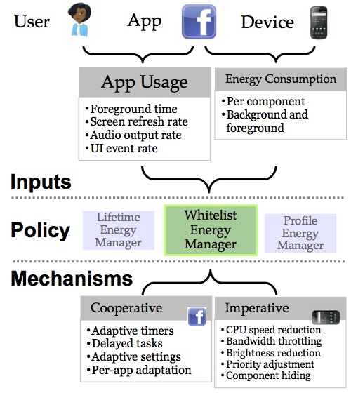

[.lead]
Despite the fact that current smartphone platforms already incorporate energy
measurement tools and multiple energy control mechanisms, smartphone battery
lifetimes continue to frustrate users. This is because measurements and
mechanisms are of limited utility without policies that utilize them to
achieve different energy management goals, such as meeting a lifetime target
or providing good performance to a user's favorite apps. To address this
problem we are developing *Jouler*, a policy framework enabling effective and
flexible smartphone energy management.

== Managing Energy Consumption

Jouler centralizes all energy management decisions currently made by
smartphone platforms or apps into a single *energy manager* with access to
all existing energy measurements and control mechanisms as well as new
mechanisms designed to enable cooperative apps. Jouler enables flexible
energy management by allowing the energy manager to be implemented as a
standard app, deployed using existing app marketplaces, and rated by users.

Our work on Jouler is inspired by a detailed energy consumption study we
conducted on the link:/projects/phonelab/[PhoneLab Smartphone Testbed].
[.pullquote]#Our results revealed enormous variation in many factors
impacting energy management#: users charge at different frequencies, use apps
that consume varying amounts of energy, and expect different battery
lifetimes from their smartphones. As a result, no "one size fits all" policy
is sufficient to satisfy the needs of all users. And even if battery
technologies and smartphone lifetimes improve in the future, managing energy
on mobile devices will continue to be an important challenge. Energy
management is about more than managing device lifetime--it is about improving
performance given limited resources and ensuring that we realize the true
potential of transformative mobile smartphones.

[.pullquote]#To enable flexible energy management Jouler employs the classic
systems design principle of *separating policy from mechanism*.# Current
smartphone platforms currently embed both policy--how energy is
allocated--and mechanism--how energy is controlled--within the platform
itself, resulting in inflexible policies which are difficult to tailor to
individual users. Jouler provides a new interface that exposes energy
management capabilities to unprivileged apps for the first time, facilitating
innovation within the energy management space. As the figure above shows,
Jouler allows multiple energy managers to be installed and configured by the
user, each potentially using different strategies to achieve different
lifetime goals.

Initial results with a small-scale deployment of Jouler have been promising,
with *six out of seven* users able to increase their battery lifetime by
using one of a small set of new energy management policies enabled by the
Jouler framework. Inspired by this result we are in the process of rolling
out Jouler to the entire PhoneLab testbed to conduct a large-scale study.

== Measuring Value

Our work on energy management using Jouler has also identified a critical
missing piece in the energy management puzzle: `value`. While a large amount
of work in the mobile systems community has focused on measuring energy
consumption, little attention has been paid to putting energy consumption
into context by identifying inherent differences between apps--both in terms
of functionality and in how valuable they are to the smartphone user.

As a complementary effort to Jouler's energy management framework we are
beginning to explore the challenge of quantifying app value. Our
link:/papers/hotmobile2015-numerator/[HotMobile'15 paper] identifies the
challenge and describes a preliminary--and unsuccessful--attempt to combine
value and energy consumption in order to help users prioritize energy
allocation on their smartphones.
