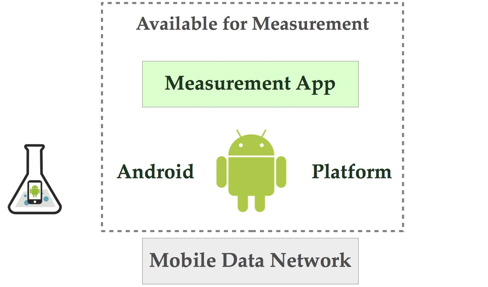

[.lead]
The 2{nbsp}billion smartphones deployed worldwide represent the largest
distributed system ever built. But while the success of app marketplaces has
made large-scale app experimentation possible, smartphones depend on
low-level platform and kernel code that is difficult for researchers to
experiment with. The over 1{nbsp}million lines of platform code that power Android
devices perform such tasks as determining the features and information
provided by the Android application programmer interface (API), managing
limited energy, and choosing which available network to use. How effectively
the platform performs these tasks has a significant impact on the
smartphone's performance and on the user's experience, and information
exposed to apps by smartphone platforms currently constrains attempts to
perform app-based measurement and data collection. PhoneLab is an open
testbed facilitating smartphone platform experimentation.

Smartphones have quickly become the most popular computing platform. Google
announced in September, 2013, that it had activated over 1{nbsp}billion Android
devices in only six years, with 500{nbsp}million in the last year alone. The
International Data Corporation projects that 224{nbsp}M smartphone units will ship
worldwide in 2013 Q4, a 40\% increase over 2012 Q4. Unfortunately, the scale
of smartphone experimentation is not keeping pace. *Together, the deployed
network of smartphones represents the most widely-deployed and powerful
distributed system ever deployed.* But while application marketplaces promise
to simplify the process of distributing innovative apps to billions of users,
no similar infrastructure exists to allow experimenters access to the
millions of low-level platform code that powers these innovative devices.

To address this gap we have built and are running the
https://www.phone-lab.org[PhoneLab] smartphone testbed. Researchers interested
in the project should visit the https://www.phone-lab.org[main project
website] to find our more. We have also published a
link:/papers/sensemine2013-phonelab[workshop paper] on the testbed.
Currently many link:/[blue] group projects are using PhoneLab, including:

* The link:/projects/jouler/[Jouler] energy management framework, which is
distributing platform changes using PhoneLab
* The link:/projects/pocketsniffer[PocketSniffer] approach to crowdsourcing
wireless spectrum allocation, which is using PhoneLab to collect low-level
networking information and distribute platform changes
* The link:/projects/maybe[`maybe`] programming construct for expressing
uncertainty at development time, which will be deployed on PhoneLab.

At some level, every project link:/[blue] does is inspired by our experiences
using PhoneLab, grounded by PhoneLab data, and driven by the unique
capabilities that the testbed provides. But we can't do enough with it, so
please help us out! The https://www.phone-lab.org/[PhoneLab website] has lots
of information to help researchers get started evaluating their own ideas on
PhoneLab. Please join us.

PhoneLab has been covered several times in the media, including
http://amherst.wgrz.com/news/news/69056-ub-students-study-smartphones-usage[this
piece by WGZR Channel 2 News],
http://www.ubspectrum.com/article/2012/09/ub-google-and-sprint-work-to-improve-smart-phones[this
article in the UB Spectrum],
http://www.buffalo.edu/news/releases/2012/08/13631.html[this official UB
press release], and
http://wivb.com/2015/11/26/ub-phone-lab-research-tries-to-spread-internet-access-to-developing-countries/[this
more recent article on WIVB Channel 4 News].
//
And if you're curious about some of the projects we've been using PhoneLab to
work on, the following video was recorded at the first annual PhoneLab
participant meeting in May, 2014:

++++

<iframe src="https://www.youtube.com/embed/TrH8_T_yORQ" allowfullscreen></iframe>

++++

