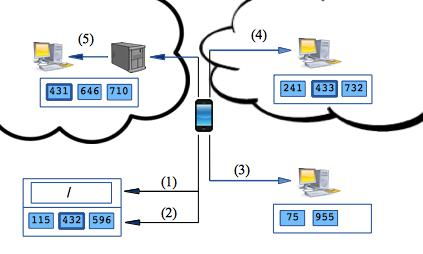

[.lead]
Centralized cloud storage services such as Dropbox have revolutionized the
way that users share files and access data across their growing number of
devices. But today's cloud storage options have serious limitations affecting
mobile battery-powered smartphones. Many central cloud storage providers
require each client to have enough storage for an entire replica, which may
not be feasible on smartphones with an order-of-magnitude less storage than
laptops and desktops. Centralized cloud storage does not scale as users add
more storage and misses the opportunity to harness free space users already
have. And centralized cloud storage provides poor support for mobile devices,
both failing to leverage natural mobility patterns when distributing data and
potentially causing costly mobile data traffic.

We are building a next-generation distributed storage service called
PocketLocker which combines storage available on multiple personal devices
into a _personal storage cloud_. PocketLocker uses erasure coding to break
files into multiple chunks which are distributed across available storage on
all participating devices. PocketLocker's data placement algorithms relies on
spatial access patterns associated with files to locate file data close to
where it will be used, allowing data traffic to be offloaded to faster and
more energy-efficient Wifi connections and decreasing the costly use of
mobile data networks. Through all of these improvements, PocketLocker creates
free personal storage clouds that are larger, faster, and more
energy-efficient than today's cloud storage solutions, while also providing
configurable tradeoffs between reliability, capacity, latency.

The figure above demonstrates how a typical file open might proceed using the
PocketLocker system. Chunks of the file may exist on the smartphone itself,
on other nearby devices owned by the user (laptops, tablets, desktops), on
the user's devices located further away (a work laptop while at home), as
well as hosted by free or paid cloud storage services that the user
subscribes to. The key research challenge PocketLocker attempts to solve is
how to determine _where_ to locate chunks to balance performance, storage
capacity, and fault tolerance. Our
link:/papers/mobicase2014-pocketlocker[MobiCASE'14 paper] provides an
overview of the entire PocketLocker architecture. Overall we consider
PocketLocker to a component of a future class of _personal cloud computing_
systems that will allow users to continuously leverage the computation,
memory, storage, and other capabilities of *all* of their personal devices.
