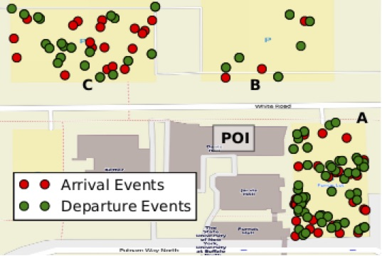

[.lead]
Parking lots present a difficult search problem. Drivers lack the visibility
to determine where spots are available, and may spend a non-trivial amount of
time searching for a spot. Searching not only generates frustration but also
wastes energy and produces harmful carbon emissions. And while several
research projects have previously attempted to solve this problem, their
solutions include requirements rendering them impractical, such as additional
infrastructure, on-vehicle equipment or vehicular networking, or onerous
manual user input. In contrast, our solution, which we call PocketParker,
requires no additional infrastructure, no vehicle modifications, and no user
input, only installation on a small percentage of the millions of smartphones
already in use.

PocketParker runs unattended in the background and uses the accelerometer to
detect parking lot arrivals and departures based on transitions between
walking and driving (departure) and walking and driving (arrival). Events are
forwarded to a central server where they are incorporated into per-lot
availability models allowing PocketParker to accurately order lots by the
probability that they contain an available spot. In general, we consider our
approach to be an example of a subset of crowdsourcing that does not require
any manual user input, which we call _pocketsourcing_.

We have designed, built, and deployed at PocketParker prototype at UB. We
distributed the Android app to 105 PhoneLab participants for 45 days in an
IRB-approved study and used camera monitoring of parking lots near Davis Hall
to provide ground truth to evaluate our modeling algorithms. The map shown
above displays some of the arrival and departure events we were able to
detect in parking lots near Davis Hall where link:/[blue] is located.
Overall, we found that PocketParker was able to determine parking lot
availability with high accuracy. Our work was published at
link:/papers/ubicomp2014-pocketparker[UbiComp'14] and reported on by the
http://www.technologyreview.com/news/530671/smartphone-movements-could-reveal-empty-parking-spots/[MIT
Technology Review].
