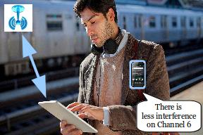

[.lead]
As wireless devices continue to proliferate and bandwidth demands continue to
grow, it is more important than ever for wireless infrastructures to
adaptively allocate limited spectrum to respond to changing demands. Accurate
channel assessment requires measurements at both ends of each wireless link,
but collecting measurements directly from active clients degrades
performance, since measuring and using a link cannot occur simultaneously. *To
address this challenge, we are developing PocketSniffer, which utilizes
passive smartphones to enable wide-area wireless infrastructure monitoring,
debugging and reconfiguration.*

As shown in the figure above, [.pullquote]#PocketSniffer utilizes the
rapidly-growing number of smartphones to perform passive observation of both
their own wireless performance and that of other nearby clients#, providing
representative client-side visibility that improves on both measurements made
by infrastructure alone or by unrepresentative site surveys. By performing
measurements only at inactive clients, PocketSniffer does not interfere with
active use---but by performing measurements at _nearby_ inactive clients,
PocketSniffer can estimate the wireless conditions experienced by active
clients. By centralizing network monitoring into a single app, PocketSniffer
provides a way to efficiently provide network monitoring data to multiple
consumers, including both large infrastructure network providers and single
home access points.

Realizing PocketSniffer requires addressing several core challenges in this
area, including:

* determining whether measurements from one device are representative of
another nearby device;
* choosing when and which measurements to collect from battery-constrained
clients;
* deciding how to utilize available measurements to improve overall
performance, particularly for multiple clients; and
* incentivizing cooperation between overlapping networks to achieve the best
global performance for all clients.

We refer to our approach that uses repeated measurements from multiple
devices to jointly allocate spectrum among multiple access points as
_crowdsourcing access network spectrum allocation using smartphones_, or
*CANSAS*. We are utilizing the link:/projects/phonelab[PhoneLab] smartphone
platform testbed combined with co-located programmable wireless access points
to explore the potential for PocketSniffer to improve wireless performance.
