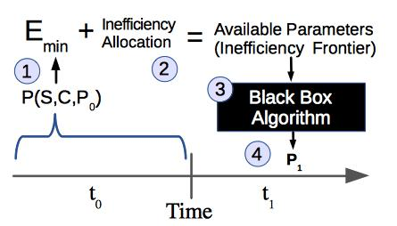

[.lead]
Energy-constrained devices such as smartphones are integrating multiple
hardware components presenting significant performance-efficiency tradeoffs:
processors and memory that can scale voltage and frequency to become more
efficient as they slow down; multiple radios that can be used interchangeably
while also tuning their polling rates and idle timeouts to trade off
efficiency for latency or throughput; and screens that can dim or reduce
refresh rates to become more efficient while reducing quality. Multiple
performance-efficiency knobs create the need for applications to continuously
select the right balance of component settings to maintain acceptable
performance while saving as much energy as possible. We refer to this ability
as *power agility*.

Achieving power agility goes hand-in-hand with effective energy management.
Previous approaches to energy management have attempted to limit or
prioritize application energy consumption using absolute constraints such as
energy or power. Unfortunately, neither constraining power nor energy is
sufficient to intelligently manage limited energy resources because neither
of these quantities reflects how _efficiently_ energy is being used. So we
have focused on identifying how efficiency changes as device components make
power-performance tradeoffs and as application requirements change. Rather
than allocate energy, we believe that treating *inefficiency* as a resource
and managing it within the operating system is a much more promising approach
than managing energy directly.

[.pullquote]#Even once effective cross-component energy management becomes
possible, it is still unclear _how_ to allocate limited energy resources in
the way that improves application performance.# As a result, we have chosen
to pursue a two-level approach where the operating system is responsible for
limiting application energy consumption while applications themselves are
allowed to make cross-component energy management tradeoffs as long as they
do not exceed their energy budget. This simplifies the operating system
energy management role while enabling flexibility in how applications use
energy to improve their own performance.

We are exploring the operating system changes necessary to achieve power
agility through a development environment that harnesses the
http://gem5.org/Main_Page[`gem5`] simulator, the http://www.linux.com[Linux kernel],
and the http://www.android.com[Android platform]. This allows us to make
changes both above and below the hardware-software boundary, and we have
utilized this freedom to implement novel complementary hardware capabilities
and software support.
